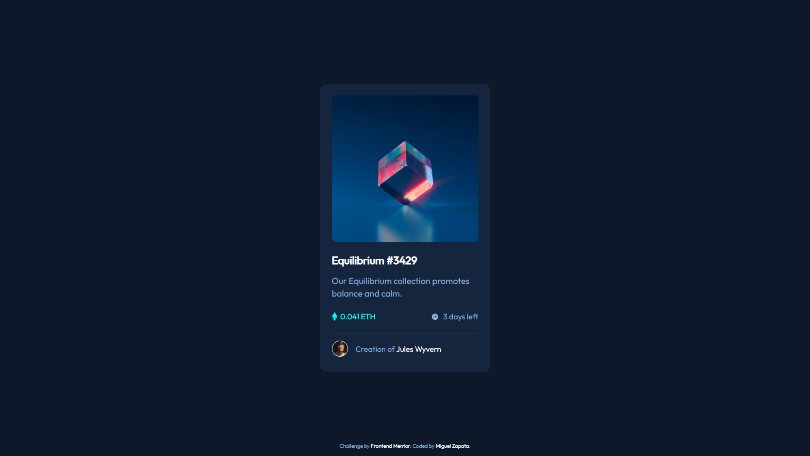

# Frontend Mentor - NFT preview card component solution

This is a solution to the [NFT preview card component challenge on Frontend Mentor](https://www.frontendmentor.io/challenges/nft-preview-card-component-SbdUL_w0U). Frontend Mentor challenges help you improve your coding skills by building realistic projects. 

## Table of contents

- [Overview](#overview)
  - [The challenge](#the-challenge)
  - [Screenshot](#screenshot)
  - [Links](#links)
- [My process](#my-process)
  - [Built with](#built-with)
  - [What I learned](#what-i-learned)
  - [Continued development](#continued-development)
  - [Useful resources](#useful-resources)
- [Author](#author)
- [Acknowledgments](#acknowledgments)


## Overview

### The challenge

Users should be able to:

- View the optimal layout depending on their device's screen size
- See hover states for interactive elements

### Screenshot



### Links

- Solution URL: [www.frontendmentor.io/solutions/nft-preview-card-component-solution](https://www.frontendmentor.io/solutions/nft-preview-card-component-solution-with-css-flexbox-rJom2zBNq)
- Live Site URL: [miguelzaga.github.io/nft-preview-card-component](https://miguelzaga.github.io/nft-preview-card-component/)

## My process

### Built with

- Semantic HTML5 markup
- SCSS
- Flexbox
- Mobile-first workflow

### What I learned

#### HTML Semantic elements

In my last project I had several issues with HTML. In this one I use a guide and I have a better understanding of the tags main, article and figure.

#### Image Overlay Effect
It is a bit messy but I am proud that I could do it and the effect looks great.
```html
<figure class="card__img-container">
  
  
  <div class="card__overlay-bg"></div>
</figure>
```

### Continued development

#### Sass
I think there are tons to learn from this language. For variables and partials is practical. I think I did not take full advantage of this and other features. I hope to get better at it.

#### HTML Semantic Elements
I thought this would be easier. There is more than meets the eye. It is interesting to see how this can help to structure a website (with out taking into consideration accesibility)

#### BEM
I think as I keep doing projects, I am going to organize my CSS better. I think that this time I use too few blocks.

### Useful resources

- [Sass Documentation](https://sass-lang.com/documentation) - It is my first time using Sass, it helped me to get started. 
- [HTML Semantic Elements](https://www.w3schools.com/html/html5_semantic_elements.asp) - This helped me to structure the HTML.
- [BEM](http://getbem.com/naming/) - This helped me to be more structured in my CSS.
- [mdn clamp()](https://developer.mozilla.org/en-US/docs/web/css/clamp) - Great way to make the an element responsive without using media queries. I used it in the card. Although, I still don't understand it that well.
- [W3 Schools Fade in Overlay](https://www.w3schools.com/howto/tryit.asp?filename=tryhow_css_image_overlay_fade) - It helped me get the hover on the image on desktop.
- [freeCodeCamp Forum](https://forum.freecodecamp.org/t/how-to-change-opacity-of-child-element-without-affecting-background-and-parent-element-opacity/374395) - I help me layer properly the image layout. It was not working because the opacity of a parent affects the children, regardless if you override the property in the child.


## Author

- Frontend Mentor - [@miguelzaga](https://www.frontendmentor.io/profile/miguelzaga)
- Linkedin - [Miguel Zapata](https://www.linkedin.com/in/miguelzaga/)

## Acknowledgments

I want to thank [Ivan](https://www.frontendmentor.io/profile/isprutfromua) because I found a comment that he made to another programmer and it was really helpful. He mentioned BEM, reset CSS and clamp() for CSS.